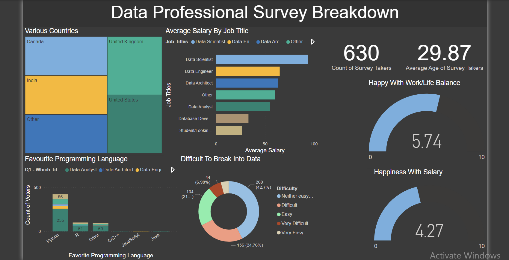

# 📊 Data Professional Survey Dashboard

This Power BI dashboard visualizes insights from a survey of 630 data professionals across different countries and job titles. It showcases:

- Average salaries by job role
- Distribution of participants by country
- Favorite programming languages
- Work/life balance and salary happiness scores
- Perceived difficulty in breaking into the data field
